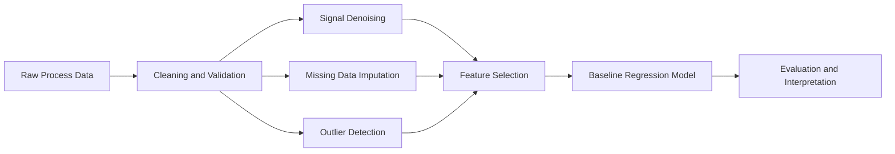
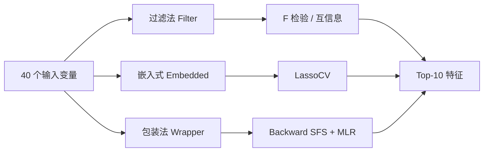

# Data Preprocessing · 数据预处理

> 面向过程系统工程的机器学习数据预处理教学与实践代码库

[](https://www.python.org/)
[](https://scikit-learn.org/)
[](#)

## Portfolio Value

This project demonstrates practical data engineering and machine learning preparation skills for process analytics. It covers the steps that make industrial datasets usable before modeling: denoising, missing-value imputation, robust outlier detection, feature selection, and baseline regression validation.



## Skills Demonstrated

- Python data analysis with NumPy, pandas, SciPy, matplotlib, and scikit-learn.
- Robust statistics using Hampel boundaries, MAD, Mahalanobis distance, and MCD covariance.
- Missing-value handling with mean and KNN imputation.
- Signal processing with moving average and Savitzky-Golay filters.
- Feature selection with filter, embedded, and wrapper methods.
- Notebook-to-script reproducibility for both learning and automation.

---

## 目录

- [项目简介](#项目简介)
- [功能概览](#功能概览)
- [项目结构](#项目结构)
- [数据集说明](#数据集说明)
- [环境配置](#环境配置)
- [快速开始](#快速开始)
- [模块详解](#模块详解)
- [推荐学习路径](#推荐学习路径)
- [技术栈](#技术栈)
- [参考资料](#参考资料)

---

## 项目简介

本项目聚焦工业过程数据的 **数据预处理（Data Preprocessing）** 环节，系统演示过程工业场景中常见的清洗、去噪、异常检测、缺失值处理与变量筛选等任务。

工业过程数据在送入机器学习模型之前，通常需要经过一系列预处理步骤。本仓库以 **Jupyter Notebook** 与等价的 **Python 脚本** 两种形式提供完整示例，涵盖从单变量到多变量、从过滤法到包装法的典型方法，并配有可视化结果，便于理解与复现。

```
原始过程数据
    │
    ├─► 信号去噪 ──────────► 平滑后的时序信号
    ├─► 异常值检测 ────────► 清洗后的样本
    ├─► 缺失值填补 ────────► 完整数据集
    ├─► 变量选择 ──────────► 精简特征子集
    └─► 多元线性回归 ──────► 基准建模与验证
```

---

## 功能概览

| 类别 | 方法 | 核心库 | 脚本 / Notebook |
|------|------|--------|-----------------|
| **单变量异常检测** | 3σ 准则、Hampel 标识符 | NumPy, SciPy | `Univariate_Outliers` |
| **多变量异常检测** | 马氏距离 + Hampel 边界 | scikit-learn | `Multivariate_Outliers_MahalanobisDistance` |
| **稳健异常检测** | MCD 稳健马氏距离 | scikit-learn | `Multivariate_Outliers_MCD` |
| **缺失值填补** | 均值填补、KNN 填补 | scikit-learn | `Missing_data_imputation` |
| **信号去噪** | 简单移动平均（SMA）、Savitzky-Golay 滤波 | Pandas, SciPy | `denoising_process_signals` |
| **过滤法变量选择** | F 检验（线性相关）、互信息（MI） | scikit-learn | `filter_Methods` |
| **嵌入式变量选择** | Lasso 回归（LassoCV） | scikit-learn | `Embedded_Method_Lasso` |
| **包装法变量选择** | 后向序列特征选择（Backward SFS） | scikit-learn | `Wrapper_Methods_backward_SFS` |
| **基准建模** | 多元线性回归（MLR） | scikit-learn | `MultivariateLinearRegression_VSdata` |

---

## 项目结构

```
Data_Preprocessing/
│
├── 📊 数据集
│   ├── VSdata.csv                  # 模拟过程数据（训练集）
│   ├── VSdata_val.csv              # 模拟过程数据（验证集）
│   ├── simple2D_outlier.csv        # 简单二维异常值示例
│   ├── complex2D_outlier.csv       # 复杂二维异常值示例
│   └── noisy_flow_signal.csv       # 含噪流量信号
│
├── 📓 Jupyter Notebooks（交互式学习）
│   ├── Univariate_Outliers.ipynb
│   ├── Multivariate_Outliers_MahalanobisDistance.ipynb
│   ├── Multivariate_Outliers_MCD.ipynb
│   ├── Missing_data_imputation.ipynb
│   ├── denoising_process_signals.ipynb
│   ├── filter_Methods.ipynb
│   ├── Embedded_Method_Lasso.ipynb
│   ├── Wrapper_Methods_backward_SFS.ipynb
│   └── MultivariateLinearRegression_VSdata.ipynb
│
├── 🐍 Python 脚本（批量运行 / 参考实现）
│   ├── Univariate_Outliers.py
│   ├── Multivariate_outliers_Mahalanobis_distance.py
│   ├── Multivariate_outliers_MCD.py
│   ├── Missing_data_imputation.py
│   ├── deNoising_process_signals.py
│   ├── filterMethods.py
│   ├── EmbeddedMethods_Lasso.py
│   ├── WrapperMethods_backward_SFS.py
│   └── MLR_VSdata.py
│
└── README.md
```

> **说明**：每个主题均提供 `.ipynb` 与 `.py` 两个版本，逻辑一致。Notebook 适合分步学习与可视化；脚本适合快速运行与集成到其他流程。

---

## 数据集说明

### `VSdata.csv` / `VSdata_val.csv`

模拟过程变量选择数据集，用于过滤法、嵌入式方法、包装法及多元线性回归示例。

| 属性 | 说明 |
|------|------|
| **训练集** `VSdata.csv` | 1000 行 × 41 列 |
| **验证集** `VSdata_val.csv` | 250 行 × 41 列 |
| **列结构** | 第 1 列为目标变量 `y`，第 2–41 列为输入特征 `X`（共 40 个变量） |
| **用途** | 变量选择、MLR 全变量 vs. 精选变量对比 |

### `simple2D_outlier.csv`

| 属性 | 说明 |
|------|------|
| **维度** | 305 行 × 2 列 |
| **异常值** | 最后 5 个样本为已知异常点 |
| **用途** | 演示经典马氏距离异常检测 |

### `complex2D_outlier.csv`

| 属性 | 说明 |
|------|------|
| **维度** | 330 行 × 2 列 |
| **异常值** | 最后 30 个样本为已知异常点 |
| **用途** | 对比非稳健马氏距离与 MCD 稳健马氏距离 |

### `noisy_flow_signal.csv`

| 属性 | 说明 |
|------|------|
| **维度** | 400 个采样点（一维时序） |
| **用途** | 演示 SMA 与 Savitzky-Golay 去噪效果 |

---

## 环境配置

### 依赖库

| 库 | 用途 |
|----|------|
| [NumPy](https://numpy.org/) | 数值计算 |
| [SciPy](https://scipy.org/) | 统计函数、信号处理 |
| [pandas](https://pandas.pydata.org/) | 移动平均等时序操作 |
| [matplotlib](https://matplotlib.org/) | 数据可视化 |
| [scikit-learn](https://scikit-learn.org/) | 机器学习预处理与建模 |

### 安装步骤

```bash
# 1. 进入项目目录
cd Data_Preprocessing

# 2. 创建并激活虚拟环境（推荐）
python -m venv .venv

# Windows
.venv\Scripts\activate

# macOS / Linux
source .venv/bin/activate

# 3. 安装依赖
pip install numpy scipy pandas matplotlib scikit-learn jupyter
```

### 已验证版本（本地 `.venv`）

| 包 | 版本 |
|----|------|
| Python | 3.12+ |
| scikit-learn | 1.9.0 |
| SciPy | 1.18.0 |
| NumPy | 2.5.0 |
| pandas | 3.0.4 |
| matplotlib | 3.11.0 |

---

## 快速开始

### 方式一：Jupyter Notebook（推荐初学）

```bash
jupyter notebook
```

在浏览器中依次打开各 `.ipynb` 文件，按单元格逐步运行并查看图表输出。

### 方式二：直接运行 Python 脚本

```bash
# 单变量异常检测
python Univariate_Outliers.py

# 多变量异常检测（马氏距离）
python Multivariate_outliers_Mahalanobis_distance.py

# 多变量异常检测（MCD）
python Multivariate_outliers_MCD.py

# 缺失值填补
python Missing_data_imputation.py

# 过程信号去噪
python deNoising_process_signals.py

# 过滤法变量选择
python filterMethods.py

# Lasso 嵌入式变量选择
python EmbeddedMethods_Lasso.py

# 后向 SFS 包装法
python WrapperMethods_backward_SFS.py

# 多元线性回归
python MLR_VSdata.py
```

> **注意**：所有脚本均假设在项目根目录下运行，以便正确读取同级 CSV 数据文件。

---

## 模块详解

### 1. 单变量异常值检测

**文件**：`Univariate_Outliers.py` / `Univariate_Outliers.ipynb`

- 生成含阶跃偏移的模拟单变量数据
- **3σ 准则**：基于样本均值与标准差设定上下界
- **Hampel 标识符**：基于中位数与 MAD（中位数绝对偏差）的稳健边界

```python
# 核心思路
mu, sigma = np.mean(X), np.std(X)           # 3σ
median = np.median(X)                        # Hampel
sigma_MAD = stats.median_abs_deviation(X)
```

---

### 2. 多变量异常值检测

#### 2a. 马氏距离（Mahalanobis Distance）

**文件**：`Multivariate_outliers_Mahalanobis_distance.py`

- 使用 `EmpiricalCovariance` 估计协方差矩阵
- 计算各样本马氏距离，经立方根变换后近似正态分布
- 以 Hampel 标识符确定异常阈值

#### 2b. MCD 稳健马氏距离

**文件**：`Multivariate_outliers_MCD.py`

- 对比 **非稳健**（`EmpiricalCovariance`）与 **稳健**（`MinCovDet`）两种估计
- 在含大量异常值的 `complex2D_outlier.csv` 上展示 MCD 的鲁棒优势

---

### 3. 缺失数据填补

**文件**：`Missing_data_imputation.py`

| 方法 | 类 | 策略 |
|------|-----|------|
| 均值填补 | `SimpleImputer` | `strategy='mean'` |
| KNN 填补 | `KNNImputer` | `n_neighbors=2` |

---

### 4. 过程信号去噪

**文件**：`deNoising_process_signals.py`

| 方法 | 说明 | 关键参数 |
|------|------|----------|
| **SMA**（简单移动平均） | `pandas.DataFrame.rolling().mean()` | `windowSize = 15` |
| **SG**（Savitzky-Golay） | `scipy.signal.savgol_filter` | `window_length=15, polyorder=2` |

---

### 5. 变量选择

三种经典范式，均在 `VSdata.csv` 上选取 **Top-10** 相关输入变量：



| 范式 | 思路 | 实现 |
|------|------|------|
| **过滤法** | 独立于模型的统计评分 | `SelectKBest` + `f_regression` / `mutual_info_regression` |
| **嵌入式** | 模型训练过程中完成选择 | `LassoCV(cv=5)`，按系数绝对值排序 |
| **包装法** | 以模型性能为导向迭代搜索 | `SequentialFeatureSelector`（后向，5 折交叉验证） |

---

### 6. 多元线性回归（MLR）

**文件**：`MLR_VSdata.py`

在 `VSdata` / `VSdata_val` 上对比两种建模策略：

1. **全变量 MLR**：使用全部 40 个输入变量
2. **精选变量 MLR**：仅使用 10 个已知相关变量（列索引 17–26）

通过 $R^2$ 评分与真实值-预测值散点图评估泛化性能。

---

## 推荐学习路径

建议按以下顺序学习，由浅入深：

```
① 信号去噪          denoising_process_signals
       ↓
② 单变量异常检测     Univariate_Outliers
       ↓
③ 多变量异常检测     Mahalanobis → MCD
       ↓
④ 缺失值填补         Missing_data_imputation
       ↓
⑤ 变量选择           Filter → Lasso → SFS
       ↓
⑥ 基准建模           MultivariateLinearRegression_VSdata
```

---

## 技术栈

```
┌─────────────────────────────────────────────┐
│              应用层（本仓库）                  │
│  异常检测 · 去噪 · 填补 · 变量选择 · MLR      │
├─────────────────────────────────────────────┤
│              scikit-learn                    │
│  preprocessing · impute · feature_selection │
│  linear_model · covariance                   │
├─────────────────────────────────────────────┤
│         SciPy · pandas · NumPy               │
├─────────────────────────────────────────────┤
│              matplotlib                      │
└─────────────────────────────────────────────┘
```

---

## 参考资料

### 关键算法文献

| 方法 | 参考 |
|------|------|
| Hampel 标识符 | Hampel, F.R. (1974). *The influence curve and its role in robust estimation* |
| MCD | Rousseeuw, P.J. (1984). *Least median of squares regression* |
| Savitzky-Golay | Savitzky, A. & Golay, M.J.E. (1964). *Smoothing and differentiation of data* |
| Lasso | Tibshirani, R. (1996). *Regression shrinkage and selection via the lasso* |

---

<p align="center">
  <sub>仅供学习与研究使用</sub>
</p>
